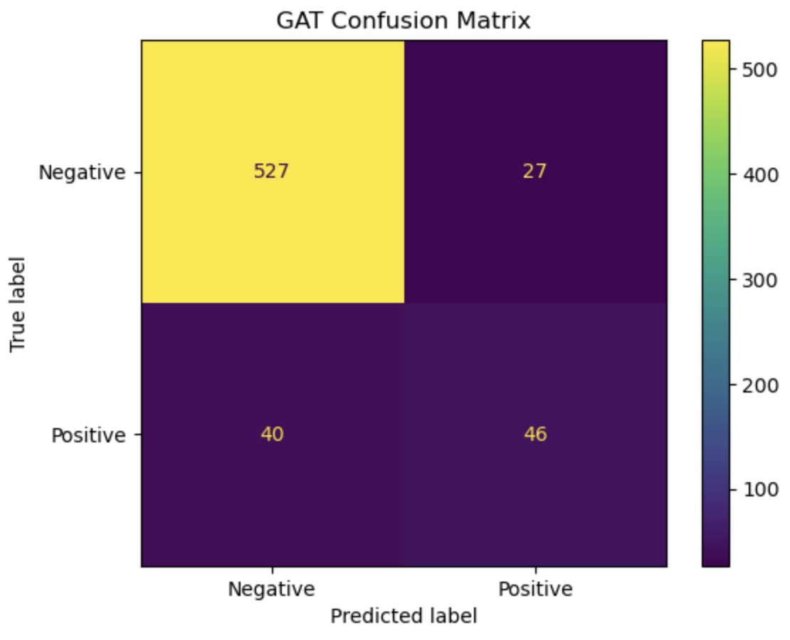
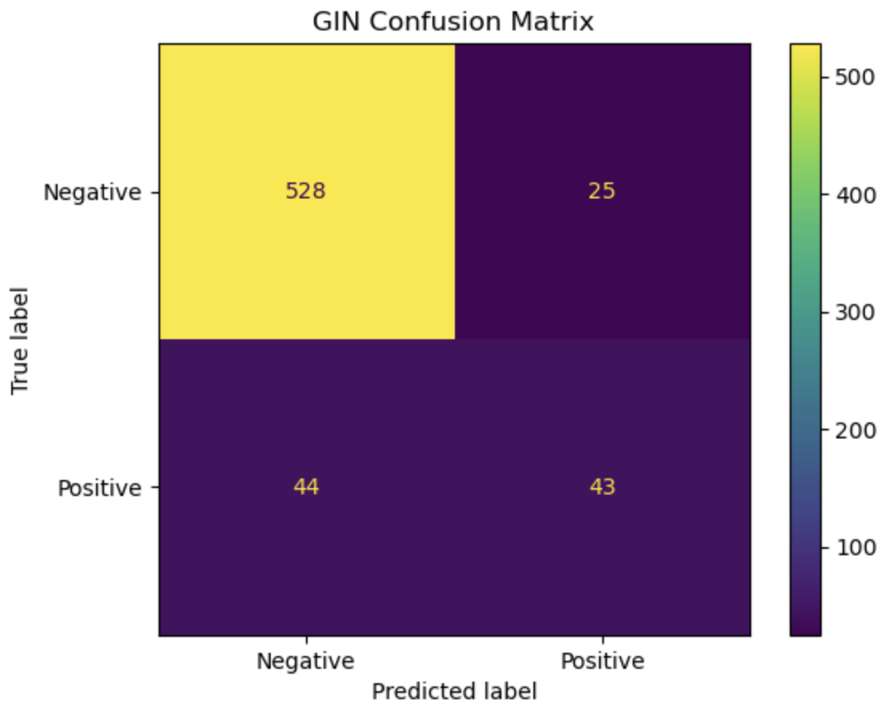
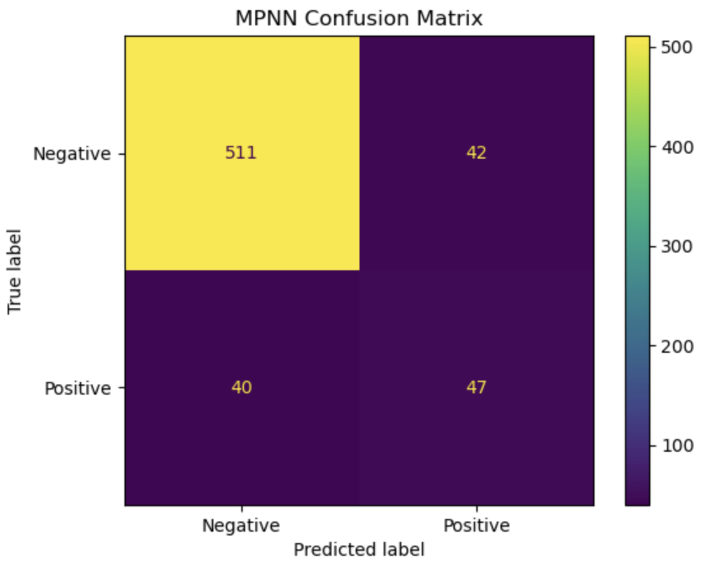
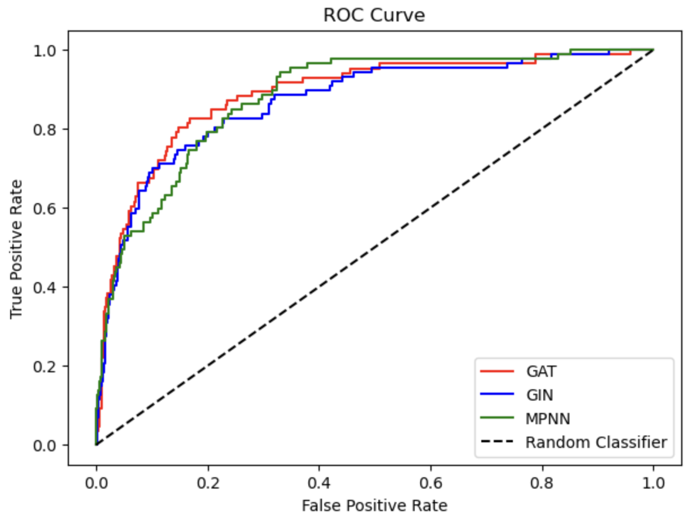
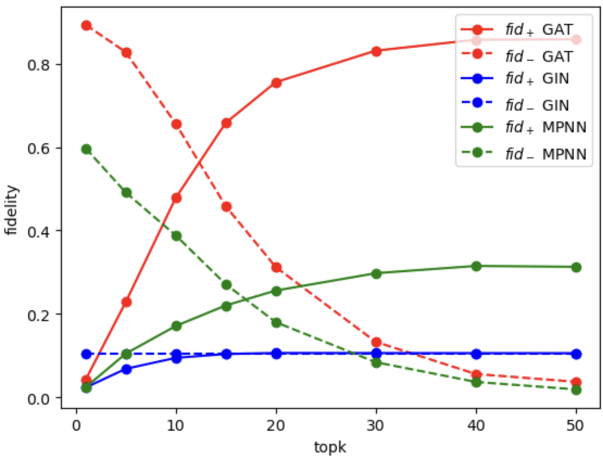
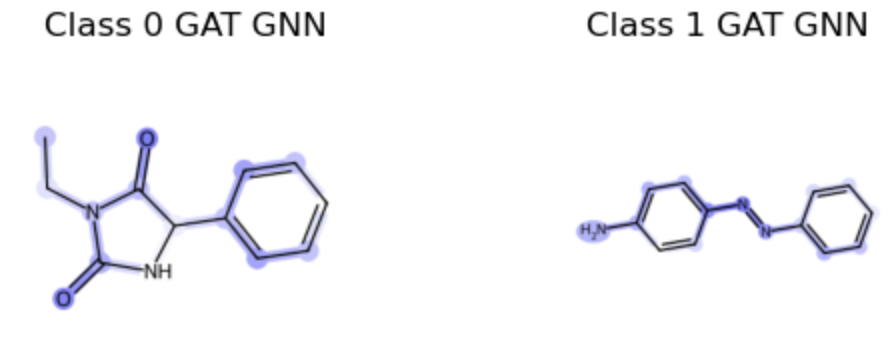
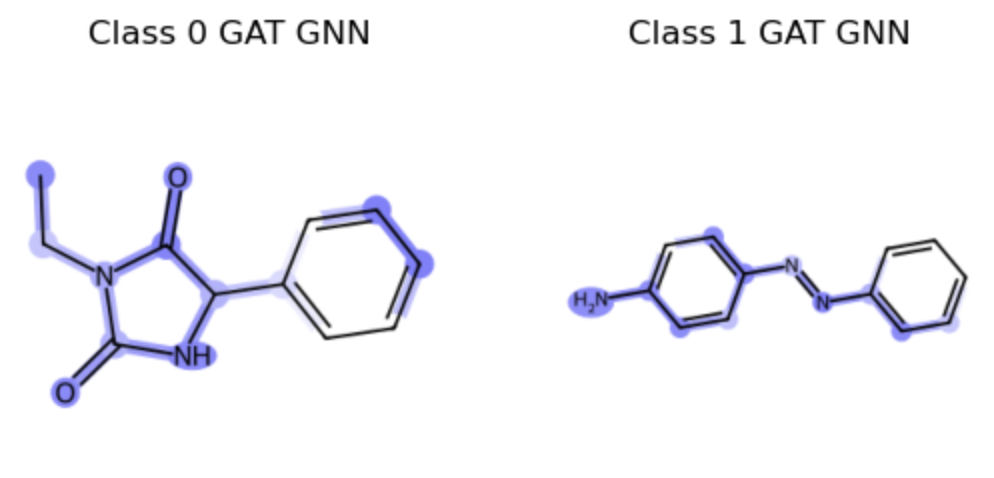

# Explaining Drug Toxicity

When it comes to determining the safety profile/ toxicity of a drug molecule, most standard computational models focus on predictive accuracy. However, when the patient's health is on the line, we cannot rely on a black box model. Our main aim through this project is to shift the focus on interpretability of the model using explainable AI and find out what kind of chemical substructures help determine the toxicity of an input molecule.

## Authors

[Maximilian Ruhdorfer](https://github.com/maxruhdorfer/xai-drug-discovery)
[Shaswata Roy](https://github.com/ShaswataRoy)
[Sunil Philip](https://github.com/sunilphil)

## Dataset

In this project we explore the TOX21 dataset (https://moleculenet.org/datasets-1) and focus on NR-AhR (Nuclear Receptor - Aryl hydrocarbon Receptor) activity. The TOX21 dataset contains 7831 samples of chemical compounds with molecular SMILES with 12 binary labels (activ/inactive) which represent the outcome of toxicological experiments.

We perform simple data-preprocessing which includes

- Ensuringing that the ID corresponds to an actual molecule and the entry is not `NaN`
- Sanitizing the molecule: check the chemical representation of the molecule
- Removing possible duplicates
- Extracting meaningful properties both at the molecular and at the atomic level
- Transforming the molecular data into `pytorch_geometric` graph data using the `rdkit` package

See `data_exploration.ipynb`.

## Models

We study three different model architectures:

1. Graph Isomorphism Network (GIN)
2. Graph Attention Network (GAT)
3. Message Passing Neural Network (MPNN)

We train these networks to generate graph representations that we pass to a linear classifier to classify graphs into non-toxic and toxic.

We perform a hyperparameter search to identify the best model and evaluate the performances according to accuracy, balanced accuracy and the area under the ROC (Receiver Operating Characteristic) curve. The performances of the final models on the test set are visualized in the confusion matrix and the ROC curve below.







The above ROC curve also shows that all models have a similar performance with a slight advantage for the GAT architecture.

## Explainability

Neural networks can seem like a black box where it is not obvious how the network reached its conclusion. Here we go back to the GAT, GIN and MPNN networks that we have previously trained and study their decision making.

In order to do so, we use post-hoc explaining algorithms. These take trained networks as an input and try to identify the features which have the biggest impact on the decision making of the network. In the case of GNNs these algorithms produce a mask for node and edge features which mask everything but the most important features and edges.

Here we focus on GNNExplainer (https://arxiv.org/abs/1903.03894) and AttentionExplainer and compore it to a DummyExplainer which produces random masks. Any explanation algorithm should at least perform better than the DummyExplainer. GNNExplainer finds masks of a fixed size which maximize the mutual information with the full graph with respect to the model predictions. The AttentionExplainer uses the learned attention coefficients in a GAT to identify the most important edges. We use the pytorch geometric implementation of these explanation algorithms (https://pytorch-geometric.readthedocs.io/en/2.5.2/modules/explain.html).

In order to evaluate how good the explanations are, we need metrics. A good explanation needs to things: i) the identified key features and edges should reproduce the model prediction (fidelity) and ii) the amount of key features and edges should be as small as possible to condense the most important information and make it understandable for humans (sparsity). In our experiments we study the fidelity as a function of sparsity, i.e. how many key features or edges we allow. A more rigorous definition of the fidelity is
$$fid_+ = 1 - \frac{1}{N}\sum_{i=1}^N \mathcal{1}(\hat{y}_i^{G_{C/S}} = \hat{y}_i)\,,$$
$$fid_- = 1 - \frac{1}{N}\sum_{i=1}^N \mathcal{1}(\hat{y}_i^{G_{S}} = \hat{y}_i)\,,$$
where the sum goes over the $N$ samples in the dataset, $G_{S}$ is the subgraph generated by the learned masks for the key features and edges and $G_{C/S}$ is its complement, the full graph without the most important features and edges.

For a good explainer one wants $fid_-$ to be small, i.e. with the few key features identified by the explainer we want to be able to reproduce the model prediction on the full graph (Note it is $1-$ average number of correct predictions of subgraph). If one restricts the sparsity, i.e. the allowed number of key features or edges, in general $fid_-$ will decrease from close to $1$ to smaller values as the number of allowed features is increased. The faster the decrease, the better the explainer. For $fid_+$ we expect the opposite. For very sparse explainer settings we expect $fid_+$ to be close to $0$, since just removing very few features or edges probably does not have a big effect on the prediction. But as $fid_-$ decreases, $fid_+$ should increase since without the key features we do not expect to be able to reproduce the model predictions accurately. However, especially in binary classification, as we will see below, those values might not always start from $0$ or $1$ but somewhere in between.

In https://arxiv.org/pdf/2206.09677 the fidelity scores are related to the two concepts of **Sufficient Explanation** and **Necessary Explanation**

- **Sufficient Explanation**: an explanation is sufficient if it leads to the right predictions on its own, i.e. it has a $fid_-$ score close to $0$. Note that it can be possible to have several sufficient explanations for the same prediction
- **Necessary Explanation**: an explanation is necessary if the prediction changes when the explanation is removed from the graph, i.e. it has a $fid_+$ score close to one.

A good explainability algorithm yields both sufficient and necessary explanations.

In our study the attention network seems to be best suited to find reliable, i.e. sufficient and necessary, explanation for the model predictions (as can be seen below). For the MPNN architecture we can find sufficient explanations but they are not as necessary as for the GAT network. For the GIN architecture we were unfortunately not able to find good explanations.



We can also compare the GNNExplainer predictions for `topk=10` for two example graphs and all considered architectures. We choose one example graph which is non-toxic and that all models classify as non-toxic and one graph that is toxic and all graphs classify as non-toxic. Ideally GNNExplainer applied to all architectures is going to find the same key features that lead to the prediction. That would be a very robust result that could be shown to a chemist or biologist who might be able to identify specific molecular properties that are responsible for the prediction. This could give new insights to what causes toxicity. The findings for the GAT and GIN architecture are shown below, where the blue shading encodes how important features and edges were in the prediction.




## Future Prospects and Conclusion

There are certain subjects that we did not have time to look into further. Going forward, one could possibly look into why attention mechanism performed significantly better. From our preliminary results we did see that the attention model tended to identify subgraphs while the other models often masked the entire molecule graph when asked which part is important. This could be because of how good the attention model is at determining neighbourhood and feature importance, and does not think all nodes, features and edges are equally important as the other models. Also, one could potentially look into previously experimentally identified chemical substructures that are known to cause NR-AhR toxicity. We could then check how many of these structures we can capture using our models. There is a wide range of possibilities, and while we have only scratched the surface, explainable AI models are definitely becoming more and more important in the drug industry.

## Directory Structure

```
xai-drug-discovery/
├── README.md
├── __pycache__/
├── data_1/
│   ├── raw/
│   │   └── tox21.csv
│   └── processed/
│       ├── pre_filter.pt
│       ├── pre_transform.pt
│       └── tox21.pt
├── data_exploration.ipynb
├── dataset.py
├── explain_results/
│   ├── GAT_Att.csv
│   ├── GAT_Dummy.csv
│   ├── GAT_GNN.csv
│   ├── GIN_Dummy.csv
│   ├── GIN_GNN.csv
│   ├── GIN_GNN_0.csv
│   ├── GIN_GNN_1.csv
│   ├── MPNN_Dummy.csv
│   └── MPNN_GNN.csv
├── explanation.ipynb
├── model_comparison.ipynb
├── model_training/
│   ├── Train_GAT.ipynb
│   ├── Train_GIN.ipynb
│   ├── Train_MPNN.ipynb
│   ├── data_1/
│   ├── dataset.py
│   ├── models.py
│   └── trainer.py
├── models/
│   ├── GAT/
│   │   └── cross-val/
│   │       ├── GAT_0_best.pth ... GAT_9_latest.pth
│   ├── GIN/
│   │   └── cross-val/
│   │       ├── GIN_0_best.pth ... GIN_9_latest.pth
│   ├── MPNN/
│   │   └── cross-val/
│   │       ├── MPNN_0_best.pth ... MPNN_9_latest.pth
│   └── final/
│       ├── GAT_best.pth
│       ├── GIN_best.pth
│       └── MPNN_best.pth
├── models.py
├── trainer.py
```

## Running the Code

`data_exploration.ipynb` For exploring the dataset and basic preprocessing. This includes

- Ensuring that the ID corresponds to an actual molecule and the entry is not _None_
- Sanitize the molecule: check and correct the chemical representation of the molecule
- Remove possible duplicates
- Extract meaningful properties both at the molecular and at the atomic level

`model_training` Contains the notebook files for training the 3 models and performing a hyperparameter search
`model_comparison.ipynb` Comparing the predictive accuracy of the 3 models
`explanation.ipynb` Applying GNNexplainer to all the 3 models and benchmarking the explanability
